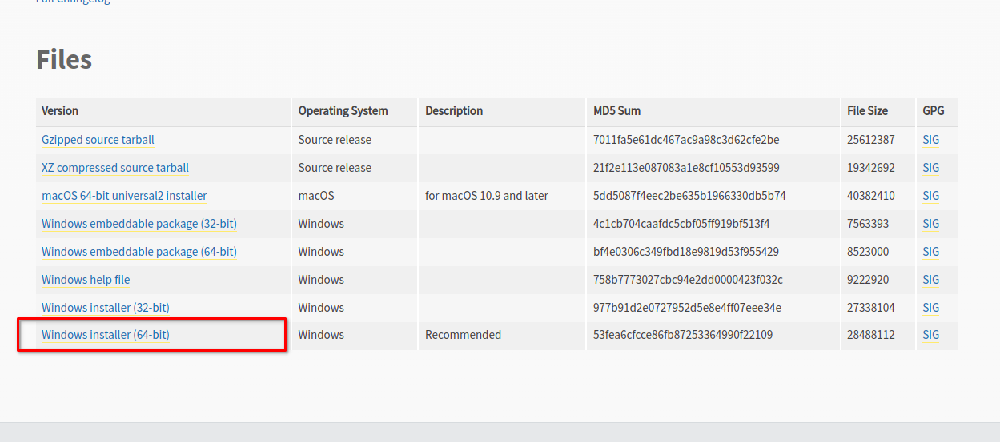
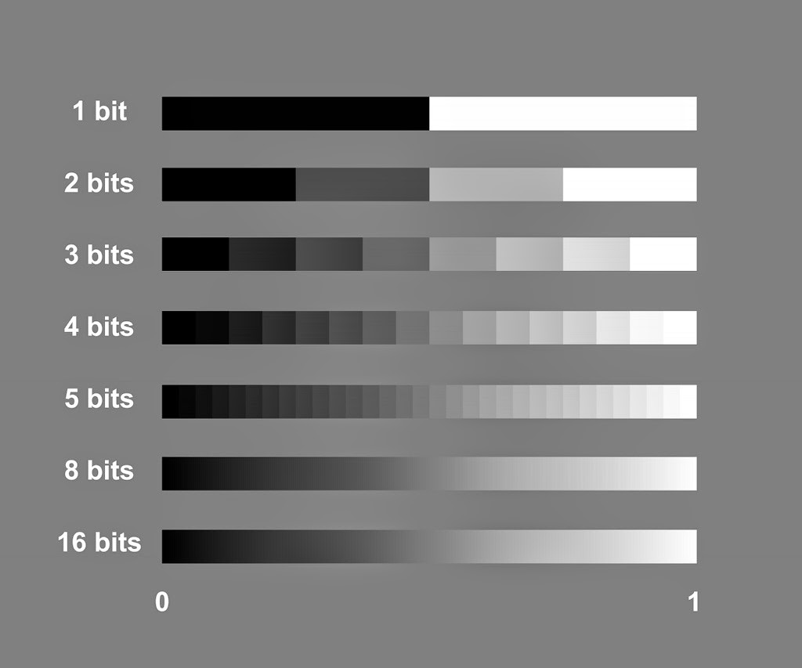

# betriebspraktikum 2022 

## installation

### python3 

### visual studio code (vscode)
https://code.visualstudio.com/download

## python3 installation 
### linux 
```
sudo apt-install python3 
sudo snap install vscode --classic
``` 
### windows 
[https://www.python.org/downloads/release/python-3104/](https://www.python.org/downloads/release/python-3104/)




## GIT push
### computer programm starten: 
linux: 'terminal'
windows: 'cmd' oder 'power shell' 
### in den ordner navigieren 
linux
```
cd /pfad/zu/meinem/betriebspraktikum_2022
```
windows
```
cd \pfad\zu\meinem\betriebspraktikum_2022
```
### kommandos / commands eingeben 

```
git status
git add . 
git commit -m 'meine hautpaenderung am source code' 
git push
```

## programmieren / software entwicklung


## how to git 
upload changes
```
git status
git add folder1 file1 meinpython.py 
git commit -m 'i have changed this and that'
git push
```

## download changes 
```
git pull
```

## bayer pattern 


## bit depth




## python fractals 
[https://github.com/jonasfrey/python_code/tree/main/fractals](https://github.com/jonasfrey/python_code/tree/main/fractals)


## fits header 
|s_key_name|s_description|
|---|---|
|TFIELDS|number of fields or columns in the table|
|NAXIS2|number of rows in the table|
|TTYPEn|for each column (n ranges from 1 to TFIELDS) gives the name of the column|
|TFORMn|the data type of the column|
|TUNITn|the physical units of the column (optional)|
|BITPIX|defines the data type of the array: 8, 16, 32, 64, -32, -64 for unsigned 8-bit byte, 16-bit| signed integer, 32-bit signed integer, 32-bit IEEE floating point, and 64-bit IEEE double precision floating point, respectively.
|NAXIS|the number of dimensions in the array, usually 0, 1, 2, 3, or 4.|
|NAXISn|(n ranges from 1 to NAXIS) defines the size of each dimension|.